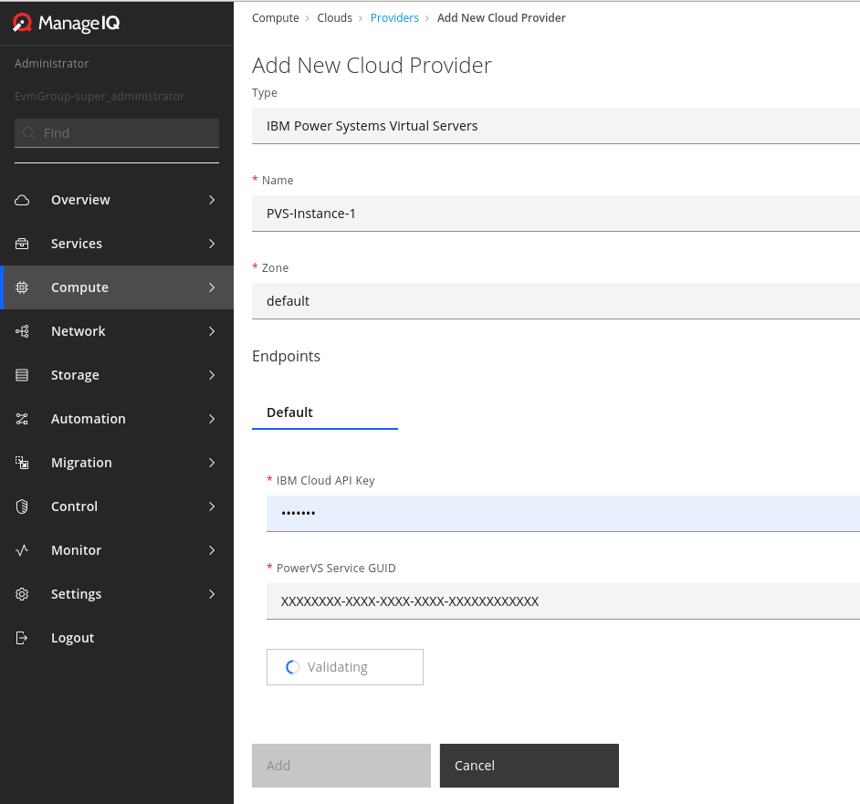

### Assumptions:

1. You have the latest installation of the ManageIQ base `>= 98cb43d08130ae...`.

2. You have `ansible-runner` application installed in your operating system.

   
3. Your ManageIQ base is located under `<MIQ_PATH>`.

### Cloning IBM Cloud Plugin Repository (needed only for the ALPHA release)

1. Enter the plugin directory `cd <MIQ_PATH>/plugins`.

2. Clone IBM Cloud Plugin repository: `git clone git@github.com:iv1111/manageiq-providers-ibm_cloud.git`.

3. Checkout the image-import tag: `git checkout image_import_alpha`.

4. Enter the "bundle.d" directory: `cd <MIQ_PATH>/bundle.d`.

5. Override IBM Cloud Plugin: `echo "ensure_gem 'manageiq-providers-ibm_cloud', :path => '<MIQ_PATH>/manageiq/plugins/manageiq-providers-ibm_cloud'" > overrides.rb`.

6. Turn off your the rails server if it's running.

7. Enter the plugin directory: `cd <MIQ_PATH>`.

8. Execute `bundle install`.

9. Start your rails server.

### Preparing IBM PowerVC Node:

1.  Using package manager install `python3.6`, `pip3`, `virtualenv` and `powervc-image` applications 
    
    as well as `libselinux-python3` library.

    
2.  Create sessions directory `/home/sessions` with enough storage to hold GBs of transient images at once.

3.  Create a virtual Python environment: `virtualenv --system-site-packages /home/sessions/venv`.

4.  Activate the newly created python environment:  `source /home/sessions/venv/bin/activate`.

5.  Install Python packages inside the Virtual Environment: `ntpath`, `base64`, `pathlib`, `pycryptodome`, `ibm_boto3`.

6.  Exit the virtual environment by running: `deactivate`.    

 
7.  Place valid PowerVC resource file under '`/opt/ibm/powervc/powervcrc`' with similar content:
    
    `export OS_IDENTITY_API_VERSION=3`
    
    `export OS_AUTH_URL=https://host:5000/v3/`
    
    `export OS_CACERT=/etc/pki/tls/certs/powervc.crt`
    
    `export OS_REGION_NAME=RegionOne`
    
    `export OS_PROJECT_DOMAIN_NAME=Default`
    
    `export OS_PROJECT_NAME=ibm-default`
    
    `export OS_TENANT_NAME=$OS_PROJECT_NAME`
    
    `export OS_USER_DOMAIN_NAME=Default`
    
    `export OS_USERNAME=root`
    
    `export OS_PASSWORD=password`
    
    `export OS_COMPUTE_API_VERSION=2.46`
    
    `export OS_NETWORK_API_VERSION=2.0`
    
    `export OS_IMAGE_API_VERSION=2`
    
    `export OS_VOLUME_API_VERSION=2`

8. Before proceeding make sure to test image exporting:

   * Execute `source /opt/ibm/powervc/powervcrc`.
     
   * Note the name of the image you want to export in the output: `powervc-image list`
   
   * Export the image `powervc-image export -i <image_name> -p /home/sessions/image.ova`

### Add a PowerVS instance

1.  Open PowerVS registration form using Cloud Providers Tab in ManageIQ.

2. Fill in the connection data and save the provider.

3. Initiate the refreshing of the provider, wait for instance images to appear.

### Add a PowerVC instance

1.  Open a PowerVC registration form using Cloud Providers Tab in ManageIQ.

2. Fill in the registration data.

3.  Open `Image Import` Tab on the registration form.

4.  Input the SSH password of the `root` user on the PowerVC node and save the provider.

5.  Initiate the refreshing of the provider, wait for instance images to appear.

### Add a Cloud Object Storage

1.  Create a new [Cloud Object Storage](https://cloud.ibm.com/objectstorage/create) instance in IBM Cloud Console.

2.  Create a new bucket through IBM console, e.g. `transient-image-bucket`.

3.  Open a Cloud Object Storage registration form using Storage Providers Tab in ManageIQ.

4.  Initiate the refreshing of the provider, wait for the cloud buckets to appear.

### Start the workflow

1. Navigate to the Power Virtual Servers provider added above.

2. Click on the `Import Image` button.

3. Choose the PowerVC provider added above as a source provider for the import.

4. Choose the image you would like to import.

5. Choose the Cloud Object Storage provider added above.

6. Choose the transient bucket created above.

7. Choose target disk type for the image being imported.

8. Decide if you want to keep transient OVA file in your bucket upon completion.

9. Submit the Image Import Request (it might take an hour or more depending on the image size).

10. You can see current progress in `ManageIQ -> Settings -> Tasks -> All Tasks -> Running`.

11.  Initiate the refreshing of the Power Virtual Servers provider, wait for the newly imported image to appear.

### Provision an instance

1. Navigate to Power Virtual Servers provider.

2. Go to Images View and click on the newly imported image.

3. Click on "`Lifecycle -> Provision Instances Using this Image`"

4. Choose the server name and set all other values as desired. 

5. Submit the provisioning workflow and wait for it to finish.

6. Connect to the newly provisioned server e.g. via SSH.